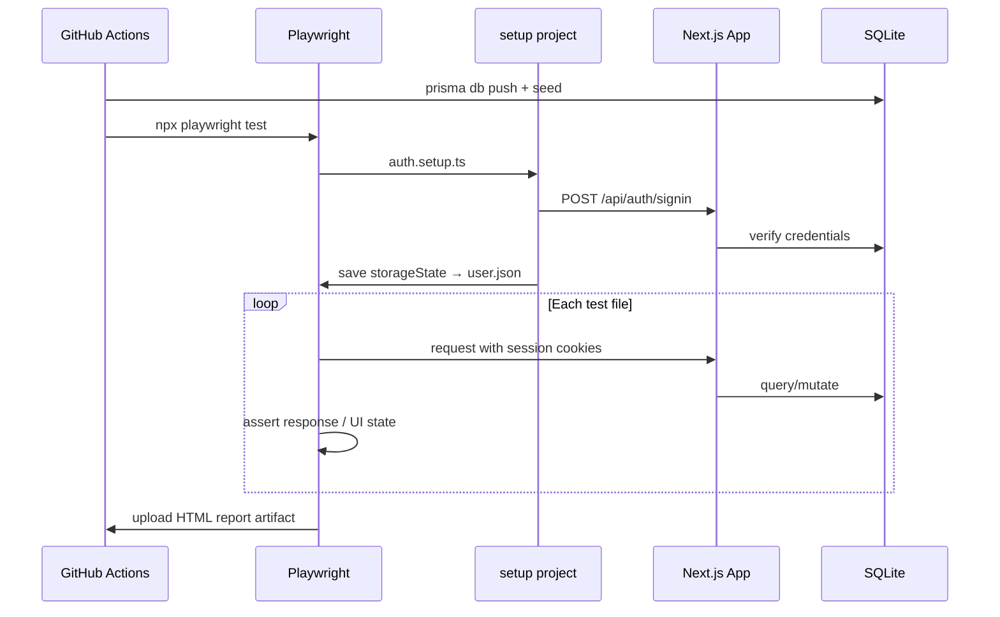

# Task Manager — Full-Stack App with Playwright CI/CD


---

## ภาษาไทย

### ภาพรวม

โปรเจคนี้เป็น showcase การเขียน **Playwright test** แบบครบวงจรบน Full-Stack application ที่สร้างขึ้นมาเอง ตั้งแต่ authentication, REST API, ไปจนถึง UI — พร้อม GitHub Actions CI/CD pipeline ที่รัน test อัตโนมัติทุกครั้งที่ push code

ต่างจากโปรเจคอื่นที่ test บนเว็บสำเร็จรูป โปรเจคนี้ **สร้าง production-grade web app ขึ้นมาเอง** เพื่อแสดงให้เห็นว่า QA engineer สามารถ test ทั้ง API layer และ UI layer ได้อย่างไร บน codebase ที่ตัวเองรู้จักทุก corner

### Tech Stack

| Layer | Technology |
|-------|-----------|
| **Frontend** | Next.js 14 (App Router), Tailwind CSS |
| **Backend** | Next.js API Routes (REST) |
| **Database** | SQLite via Prisma ORM |
| **Auth** | NextAuth.js (JWT + CredentialsProvider) |
| **Testing** | Playwright 1.49 (UI + API) |
| **CI/CD** | GitHub Actions |
| **Language** | TypeScript 5.6 (strict mode) |

### Features ที่ implement และ test แล้ว

โปรเจคนี้พัฒนาแบบ **iterative development cycle** — implement feature → เขียน test → commit → push ทีละอย่าง เหมือนงานจริงใน production team:

| # | Feature | Test IDs |
|---|---------|----------|
| 1 | **Overdue highlight** — task ที่เลยกำหนดแสดง red border + "Overdue" badge | TC-TASK-09 |
| 2 | **Stats bar** — แสดง `N Todo · N In Progress · N Done` เหนือ task list | TC-TASK-10 |
| 3 | **Confirm dialog before delete** — "Are you sure?" ก่อนลบ task | TC-TASK-11 |
| 4 | **Filter-aware empty state** — "No HIGH priority tasks" แทน generic message | TC-TASK-12 |
| 5 | **Keyboard shortcut "N"** — กด N เพื่อเปิด modal สร้าง task ใหม่ | TC-TASK-13, 13b |
| 6 | **Real-time search** — search input กรอง task ตาม title ผ่าน `?search=` API | TC-TASK-14/15, TC-API-11/12 |
| 7 | **Pagination** — `?page=&limit=` (default 10), มี Prev/Next controls | TC-API-13 |
| 8 | **Task sort** — `?sortBy=(createdAt\|dueDate\|priority)&sortOrder=(asc\|desc)` | TC-API-14, TC-TASK-16 |

### Playwright Testing Techniques

#### 1. storageState — Login Once, Reuse Everywhere

แทนที่จะ login ซ้ำทุก test (เสีย ~3 วินาทีต่อ test) ใช้ `setup` project ที่รัน login ครั้งเดียว แล้ว save session ไว้เป็น JSON:

```typescript
// tests/setup/auth.setup.ts
await page.fill('[data-testid="login-email"]', 'test@taskmanager.dev');
await page.fill('[data-testid="login-password"]', 'Test@1234');
await page.click('[data-testid="login-submit"]');
await page.context().storageState({ path: 'tests/.auth/user.json' });
```

```typescript
// playwright.config.ts
projects: [
  { name: 'setup', testMatch: /setup\/auth\.setup\.ts/ },
  {
    name: 'chromium',
    use: { storageState: 'tests/.auth/user.json' },
    dependencies: ['setup'],  // รอ setup ก่อนเสมอ
  },
]
```

ประหยัดเวลา login ซ้ำสำหรับทุก test ที่ต้องการ authentication

#### 2. Override storageState สำหรับ Unauthenticated Tests

Auth tests ต้องการ session ว่างเปล่า — override ด้วย empty storageState:

```typescript
// tests/auth.spec.ts
test.use({ storageState: { cookies: [], origins: [] } });
```

ทำให้ test group เดียวกันสามารถมีทั้ง authenticated และ unauthenticated tests ได้

#### 3. API Testing ด้วย `request` Fixture

Test REST API โดยตรงโดยไม่ผ่าน browser — เร็วกว่าและ reliable กว่า UI click:

```typescript
test('TC-API-01: GET /api/tasks คืน paginated response', async ({ request }) => {
  const res = await request.get('/api/tasks');
  const body = await res.json();
  expect(Array.isArray(body.data)).toBe(true);
  expect(typeof body.total).toBe('number');
  expect(body.totalPages).toBeGreaterThanOrEqual(1);
});
```

`request` fixture ใช้ storageState เดียวกับ `page` → authenticated โดยอัตโนมัติ

#### 4. data-testid Strategy

ทุก interactive element ใช้ `data-testid` attribute แทน CSS selector:

```
login-email, login-password, login-submit, login-error
task-card, task-title, task-complete-btn, task-edit-btn, task-delete-btn
create-task-btn, task-title-input, task-description-input
task-priority-select, task-status-select, task-due-date-input, task-submit-btn
filter-priority, filter-status, search-input, sort-by, sort-order
stats-bar, stats-todo, stats-in-progress, stats-done
overdue-badge, confirm-dialog, confirm-delete-btn, confirm-cancel-btn
pagination, pagination-prev, pagination-next, pagination-info
empty-state, empty-state-message
```

`data-testid` ไม่เปลี่ยนเมื่อ refactor CSS หรือ rename class → test stable มากกว่า

#### 5. webServer — Auto-start App ก่อนรัน Tests

```typescript
webServer: {
  command: 'npm run dev',
  url: 'http://localhost:3000',
  reuseExistingServer: !process.env.CI,  // local: reuse, CI: always fresh
  timeout: 120_000,
}
```

ไม่ต้องรัน `npm run dev` แยกก่อน test — Playwright จัดการให้อัตโนมัติ

### Test Coverage ทั้งหมด (30+ tests)

#### Auth Tests (`tests/auth.spec.ts`)
| Test ID | Scenario |
|---------|----------|
| TC-AUTH-01 | Login สำเร็จด้วย credentials ถูกต้อง |
| TC-AUTH-02 | Login ล้มเหลวด้วย password ผิด |
| TC-AUTH-03 | Login ล้มเหลวด้วย email ที่ไม่มีในระบบ |
| TC-AUTH-04 | Redirect ไป login เมื่อเข้า /tasks โดยไม่ได้ login |
| TC-AUTH-05 | Register user ใหม่สำเร็จ |
| TC-AUTH-06 | Register ล้มเหลวเมื่อ email ซ้ำ |

#### API Tests (`tests/api.spec.ts`)
| Test ID | Scenario |
|---------|----------|
| TC-API-01 | GET /api/tasks คืน paginated response (`data`, `total`, `page`, `totalPages`) |
| TC-API-02 | POST /api/tasks สร้าง task คืน 201 |
| TC-API-03 | POST /api/tasks ไม่มี title คืน 400 |
| TC-API-04 | PUT /api/tasks/:id update status เป็น DONE |
| TC-API-05 | DELETE /api/tasks/:id ลบ task |
| TC-API-06 | PUT task ที่ไม่มีอยู่คืน 404 |
| TC-API-07 | GET ?priority=HIGH filter ถูกต้อง |
| TC-API-08 | GET /api/tasks ไม่ login คืน 401 |
| TC-API-09 | POST /api/tasks ไม่ login คืน 401 |
| TC-API-10 | POST /api/register สร้าง user ใหม่คืน 201 |
| TC-API-11 | GET ?search= filter by title |
| TC-API-12 | GET ?search=xxx ที่ไม่มีผลลัพธ์คืน data ว่าง |
| TC-API-13 | GET ?page=1&limit=2 คืน max 2 tasks |
| TC-API-14 | GET ?sortBy=dueDate&sortOrder=asc เรียงถูกต้อง |

#### Task UI Tests (`tests/tasks.spec.ts`)
| Test ID | Scenario |
|---------|----------|
| TC-TASK-01 | สร้าง task ใหม่ปรากฏใน list |
| TC-TASK-02 | แก้ไข title ของ task |
| TC-TASK-03 | Mark complete → card แสดง opacity-60 |
| TC-TASK-04 | ลบ task ผ่าน confirm dialog |
| TC-TASK-05 | สร้าง task พร้อม description + status IN_PROGRESS |
| TC-TASK-06 | Filter by HIGH priority |
| TC-TASK-07 | Filter by DONE status |
| TC-TASK-08 | Reset filter แสดง task ทั้งหมด |
| TC-TASK-09 | Task ที่ due date เลยกำหนดแสดง Overdue badge + red border |
| TC-TASK-10 | Stats bar แสดงจำนวน Todo / In Progress / Done |
| TC-TASK-11 | Confirm dialog ปรากฏเมื่อกด delete, Cancel ไม่ลบ |
| TC-TASK-12 | Filter-aware empty state แสดงข้อความเฉพาะ |
| TC-TASK-13 | กด "N" เปิด new task modal |
| TC-TASK-13b | กด "N" ขณะอยู่ใน input ไม่ trigger shortcut |
| TC-TASK-14 | Search input กรอง task ตาม title real-time |
| TC-TASK-15 | Search ที่ไม่มี match แสดง empty state พร้อมข้อความ |
| TC-TASK-16 | เปลี่ยน Sort field/order ทำให้ task list reload |

### Architecture

```
┌─────────────────────────────────────────────────┐
│                  Browser (Playwright)            │
│  UI Tests ──────► Next.js Pages & Components    │
│  API Tests ─────► Next.js API Routes            │
└──────────────────────────┬──────────────────────┘
                           │
             ┌─────────────▼────────────┐
             │      Prisma ORM          │
             │   (Query Builder +       │
             │    Type Safety)          │
             └─────────────┬────────────┘
                           │
             ┌─────────────▼────────────┐
             │    SQLite Database       │
             │  (prisma/dev.db)         │
             └──────────────────────────┘
```

### โครงสร้างโปรเจค

```
task-manager/
├── app/
│   ├── (auth)/
│   │   ├── login/page.tsx          # Login form
│   │   └── register/page.tsx       # Register form
│   ├── (dashboard)/
│   │   └── tasks/page.tsx          # Tasks page (protected)
│   └── api/
│       ├── auth/[...nextauth]/     # NextAuth handler
│       ├── register/route.ts       # POST /api/register
│       └── tasks/
│           ├── route.ts            # GET (paginated+filtered+sorted) / POST
│           └── [id]/route.ts       # PUT / DELETE
├── components/
│   ├── TaskCard.tsx                # Task card + overdue badge
│   ├── TaskForm.tsx                # Create/Edit modal form
│   └── TasksClient.tsx             # Main client component (state, filters, pagination, sort)
├── lib/
│   ├── auth.ts                     # NextAuth config (CredentialsProvider + JWT)
│   └── prisma.ts                   # Prisma client singleton
├── prisma/
│   ├── schema.prisma               # User + Task models
│   └── seed.ts                     # Idempotent seed (test@taskmanager.dev)
├── tests/
│   ├── setup/auth.setup.ts         # Login once → save storageState
│   ├── auth.spec.ts                # Auth flow tests (6 tests)
│   ├── api.spec.ts                 # API tests (14 tests)
│   └── tasks.spec.ts               # UI tests (16 tests)
├── .github/workflows/ci.yml        # GitHub Actions CI pipeline
├── playwright.config.ts
├── next.config.js
└── package.json
```

### CI/CD Pipeline (GitHub Actions)

```yaml
# .github/workflows/ci.yml
jobs:
  test:
    runs-on: ubuntu-latest
    steps:
      - Setup Node.js 20
      - npm ci
      - npx prisma generate        # สร้าง Prisma client
      - npx prisma db push         # สร้าง schema ใน SQLite
      - npx tsx prisma/seed.ts     # seed test user
      - npx playwright install chromium
      - npx playwright test        # รัน test ทั้งหมด
      - Upload HTML report (artifact)
```

ทุก push และ pull request จะ trigger pipeline นี้อัตโนมัติ ผลลัพธ์ (pass/fail) แสดงใน badge ด้านบน

### API Reference

#### `GET /api/tasks`

| Parameter | Type | Default | Description |
|-----------|------|---------|-------------|
| `page` | number | 1 | หน้าที่ต้องการ |
| `limit` | number | 10 | จำนวน task ต่อหน้า (max 100) |
| `priority` | string | — | filter: HIGH / MEDIUM / LOW |
| `status` | string | — | filter: TODO / IN_PROGRESS / DONE |
| `search` | string | — | filter by title (contains) |
| `sortBy` | string | createdAt | createdAt / dueDate / priority |
| `sortOrder` | string | desc | asc / desc |

**Response:**
```json
{
  "data": [...],
  "total": 25,
  "page": 1,
  "limit": 10,
  "totalPages": 3
}
```

### วิธีรัน

```bash
# ติดตั้ง dependencies
npm install
npx prisma generate
npx prisma db push
npx tsx prisma/seed.ts     # สร้าง test user

# รัน dev server
npm run dev                 # http://localhost:3000

# รัน tests (dev server ต้องรันก่อน หรือ Playwright จะ start ให้อัตโนมัติ)
npx playwright test

# รัน test เฉพาะไฟล์
npx playwright test tests/api.spec.ts
npx playwright test tests/auth.spec.ts
npx playwright test tests/tasks.spec.ts

# รัน headed mode (เห็น browser)
npx playwright test --headed

# ดู HTML report
npx playwright show-report
```

**Test credentials (seed):**
```
Email:    test@taskmanager.dev
Password: Test@1234
```

---

## English

### Overview

This project demonstrates **end-to-end Playwright testing** on a full-stack application built from scratch — covering authentication flows, REST API validation, and rich UI interactions, all wired to a GitHub Actions CI/CD pipeline that runs automatically on every push.

Unlike other showcase projects that test against third-party websites, this one **owns the entire stack** — giving full control over test data, API contracts, and UI behaviour.

### Key Design Decisions

**1. `storageState` for session sharing** — Login runs once in a dedicated `setup` project. All other tests inherit the session from a saved JSON file, saving ~3s per test that would otherwise be spent on login flows.

**2. `data-testid` attributes everywhere** — Selectors are decoupled from CSS class names and DOM structure. Refactoring the UI never breaks the tests.

**3. `request` fixture for API tests** — REST endpoints are validated directly without browser overhead. The fixture automatically inherits `storageState`, so authenticated API calls work out of the box.

**4. `webServer` config** — `reuseExistingServer: !process.env.CI` means locally you can have the dev server already running; in CI a fresh server starts automatically before any test runs.

**5. Idempotent seed** — The seed script deletes and recreates the test user on every run, so CI always starts from a known state regardless of previous runs.

**6. Iterative feature development** — Every feature was implemented in a complete cycle: write code → write test → TypeScript check → commit → push. This mirrors a real sprint workflow and ensures every shipped feature has test coverage.

### Architecture — Test Execution Flow



### Requirements

- Node.js 18+
- `npm install`
- `npx prisma generate && npx prisma db push`
- `npx tsx prisma/seed.ts`
- `npx playwright install chromium`
