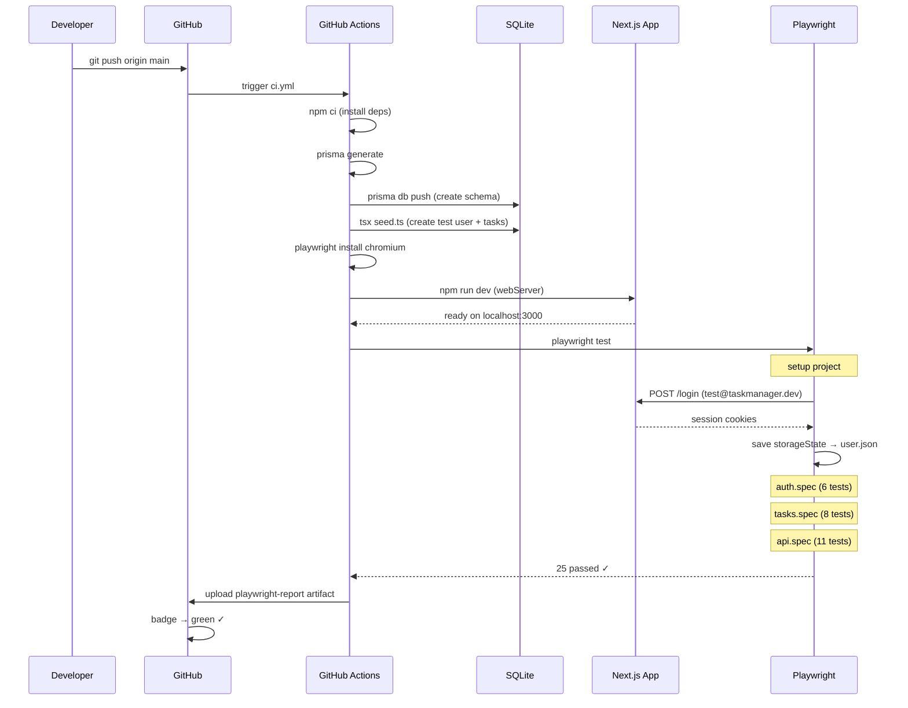
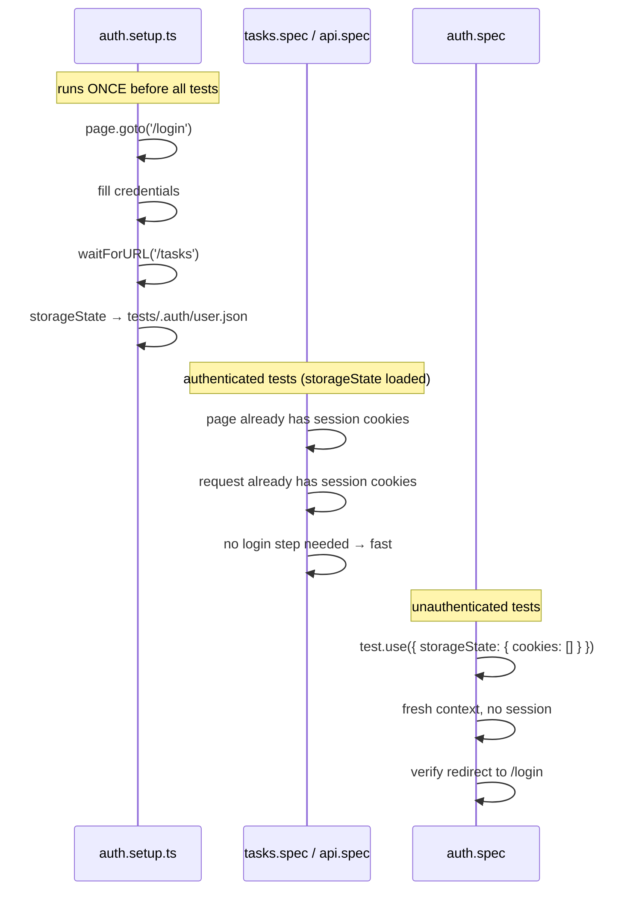

# Task Manager — Full-Stack Playwright Showcase


---

## ภาษาไทย

### ภาพรวม

โปรเจคนี้เป็น **Full-Stack Web Application** ที่สร้างขึ้นเพื่อโชว์สกิล QA Automation ระดับ senior แบบ end-to-end จริงๆ ตั้งแต่การสร้างแอป → เขียน test → รัน CI/CD อัตโนมัติ ต่างจากโปรเจคอื่นที่ test บนเว็บสำเร็จรูป โปรเจคนี้ **สร้างแอปเอง** แล้ว test เอง เหมือนงานจริงในบริษัท

### ทำไมโปรเจคนี้พิเศษ

| จุดเด่น | รายละเอียด |
|---------|-----------|
| **สร้างแอปเอง** | Full-stack Next.js พร้อม auth, database, REST API |
| **CI badge live** | ทุกครั้งที่ push ผลลัพธ์ test ขึ้น GitHub จริง |
| **storageState** | Login ครั้งเดียว share ทุก test — ไม่ waste time login ซ้ำ |
| **API + UI combined** | ทั้ง E2E UI test และ API test ในโปรเจคเดียว |
| **data-testid** | Selector ที่ stable — ไม่แตกเมื่อ UI เปลี่ยน |
| **Seed แบบ idempotent** | รัน seed กี่ครั้งก็ได้ผลเหมือนกัน — CI ปลอดภัย |

### Tech Stack

| Layer | Technology | เหตุผล |
|-------|-----------|--------|
| **Frontend** | Next.js 14 App Router | Full-stack ในโปรเจคเดียว ไม่ต้องแยก repo |
| **Database** | SQLite + Prisma ORM | Zero setup ใน CI, type-safe query |
| **Auth** | NextAuth.js (JWT) | Production-ready, ใช้จริงในบริษัท |
| **Styling** | Tailwind CSS | Utility-first, ไม่ต้องเขียน CSS เอง |
| **Testing** | Playwright | E2E + API test ในเครื่องมือเดียว |
| **CI/CD** | GitHub Actions | Free สำหรับ public repo, native badge |

### โครงสร้างโปรเจค

```
task-manager/
├── .github/
│   └── workflows/
│       └── ci.yml              # GitHub Actions pipeline
├── app/
│   ├── (auth)/
│   │   ├── login/page.tsx      # หน้า login
│   │   └── register/page.tsx   # หน้าสมัครสมาชิก
│   ├── (dashboard)/
│   │   ├── layout.tsx          # ป้องกัน route ที่ต้อง auth
│   │   └── tasks/page.tsx      # หน้าหลัก task list
│   └── api/
│       ├── auth/[...nextauth]/ # NextAuth handler
│       ├── register/           # POST /api/register
│       └── tasks/              # GET, POST /api/tasks
│           └── [id]/           # PUT, DELETE /api/tasks/:id
├── components/
│   ├── TasksClient.tsx         # CRUD logic (client component)
│   ├── TaskCard.tsx            # Task item UI
│   ├── TaskForm.tsx            # Create/Edit form
│   ├── Navbar.tsx              # Top nav + logout
│   └── SessionProvider.tsx     # NextAuth wrapper
├── lib/
│   ├── auth.ts                 # NextAuth config
│   └── prisma.ts               # Prisma singleton
├── prisma/
│   ├── schema.prisma           # DB schema (User, Task)
│   └── seed.ts                 # Deterministic test data
├── tests/
│   ├── setup/
│   │   └── auth.setup.ts       # Login once → save storageState
│   ├── auth.spec.ts            # 6 auth tests
│   ├── tasks.spec.ts           # 8 UI CRUD tests
│   └── api.spec.ts             # 11 API tests
└── playwright.config.ts        # webServer + storageState config
```

### CI/CD ทำงานยังไง

```
1. git push → GitHub รับ code
2. GitHub Actions trigger ci.yml
3. Install dependencies (npm ci)
4. Generate Prisma client
5. สร้าง SQLite database (prisma db push)
6. Seed test data (tsx prisma/seed.ts)
7. Install Playwright browser (chromium)
8. Start Next.js dev server (webServer ใน playwright.config.ts)
9. รัน Playwright tests (25 tests)
10. Upload HTML report เป็น artifact
11. Badge บน README เปลี่ยนเป็นสีเขียว ✓
```

**Badge ที่ขึ้น README** ดึงผลจาก GitHub Actions จริง — ไม่ใช่แค่รูปภาพ static:

```markdown

```

### เทคนิค Senior ที่โชว์ในโปรเจคนี้

#### 1. storageState — Login ครั้งเดียว ใช้ทุก Test

ถ้า login ใหม่ทุก test: 25 tests × ~3 วินาที = **75 วินาทีเสียเปล่า**

Playwright รองรับ `storageState` — บันทึก cookies + JWT token หลัง login แล้วโหลดซ้ำ:

```typescript
// tests/setup/auth.setup.ts
setup('authenticate', async ({ page }) => {
  await page.goto('/login');
  await page.getByTestId('login-email').fill('test@taskmanager.dev');
  await page.getByTestId('login-password').fill('Test@1234');
  await page.getByTestId('login-submit').click();
  await page.waitForURL('/tasks');

  // บันทึก session ลงไฟล์
  await page.context().storageState({ path: 'tests/.auth/user.json' });
});
```

```typescript
// playwright.config.ts
projects: [
  { name: 'setup', testMatch: /auth\.setup\.ts/ },
  {
    name: 'chromium',
    use: { storageState: 'tests/.auth/user.json' }, // โหลด session
    dependencies: ['setup'],                         // รัน setup ก่อน
  },
],
```

#### 2. test.use() Override — Unauthenticated Tests

test บางตัวต้องการ fresh session (ไม่ login) เช่น verify redirect behavior:

```typescript
// tests/auth.spec.ts
test.use({ storageState: { cookies: [], origins: [] } }); // clear auth

test('redirect to /login when not authenticated', async ({ page }) => {
  await page.goto('/tasks');
  await expect(page).toHaveURL('/login'); // ต้อง redirect
});
```

#### 3. API Testing ด้วย Authenticated Request

`request` fixture ของ Playwright ใช้ `storageState` เดียวกับ browser — ทำให้ test API ในสภาพ authenticated โดยไม่ต้องทำ login แยก:

```typescript
test('GET /api/tasks คืน array', async ({ request }) => {
  const res = await request.get('/api/tasks'); // มี session cookie อัตโนมัติ
  expect(res.status()).toBe(200);
  const tasks = await res.json();
  expect(Array.isArray(tasks)).toBe(true);
});
```

#### 4. webServer — Auto-start App ก่อน Test

ไม่ต้องรัน `npm run dev` เองก่อน test — Playwright จัดการให้:

```typescript
// playwright.config.ts
webServer: {
  command: 'npm run dev',
  url: 'http://localhost:3000',
  reuseExistingServer: !process.env.CI, // CI: start fresh, local: reuse
  timeout: 120_000,
},
```

ใน CI มันจะ start server ใหม่เสมอ — ใน local ถ้า `localhost:3000` มีอยู่แล้วก็ใช้ต่อ

#### 5. data-testid — Stable Selectors

```tsx
// ✅ ถูก: selector ที่ไม่แตกเมื่อ UI เปลี่ยน
<button data-testid="create-task-btn">+ New task</button>
<input data-testid="task-title-input" />
<div data-testid="task-card">...</div>

// ❌ ผิด: selector ที่แตกง่าย
page.locator('.btn-primary')    // class เปลี่ยนได้
page.locator('button:nth-child(2)') // order เปลี่ยนได้
page.locator('text=New task')  // ภาษาเปลี่ยน, text เปลี่ยน
```

#### 6. Idempotent Seed — CI ปลอดภัย

```typescript
// prisma/seed.ts
async function main() {
  // ลบ test data เดิมออกก่อน (delete → recreate)
  await prisma.task.deleteMany({ where: { user: { email: 'test@...' } } });
  await prisma.user.deleteMany({ where: { email: 'test@...' } });

  // สร้างใหม่
  await prisma.user.create({ data: { email: 'test@...', tasks: { create: [...] } } });
}
```

รัน seed กี่ครั้งก็ได้ผลเหมือนกัน — CI รัน seed ทุกครั้งที่ pipeline เริ่ม

### รายการ Test ทั้งหมด (25 tests)

#### auth.spec.ts (6 tests)
| Test | สิ่งที่ verify |
|------|----------------|
| TC-AUTH-01 | Login สำเร็จ → redirect /tasks |
| TC-AUTH-02 | Password ผิด → error message |
| TC-AUTH-03 | Register → auto-login → redirect /tasks |
| TC-AUTH-04 | เข้า /tasks โดยไม่ login → redirect /login |
| TC-AUTH-05 | Logout → redirect /login |
| TC-AUTH-06 | Register email ซ้ำ → error 409 |

#### tasks.spec.ts (8 tests)
| Test | สิ่งที่ verify |
|------|----------------|
| TC-TASK-01 | Create task → ปรากฏใน list |
| TC-TASK-02 | Edit task title → อัปเดตใน list |
| TC-TASK-03 | Mark complete → card แสดง opacity-60 |
| TC-TASK-04 | Delete task → หายจาก list |
| TC-TASK-05 | Create task พร้อม description + status |
| TC-TASK-06 | Filter HIGH priority → เห็นเฉพาะ HIGH |
| TC-TASK-07 | Filter DONE status → เห็นเฉพาะ DONE |
| TC-TASK-08 | Reset filter → เห็น task ทั้งหมด |

#### api.spec.ts (11 tests)
| Test | Endpoint | สิ่งที่ verify |
|------|----------|----------------|
| TC-API-01 | GET /api/tasks | 200 + array |
| TC-API-02 | POST /api/tasks | 201 + created object |
| TC-API-03 | POST /api/tasks (no title) | 400 |
| TC-API-04 | PUT /api/tasks/:id | 200 + updated status |
| TC-API-05 | DELETE /api/tasks/:id | 200 + success |
| TC-API-06 | PUT task ที่ไม่มีอยู่ | 404 |
| TC-API-07 | GET /api/tasks?priority=HIGH | filter ถูกต้อง |
| TC-API-08 | GET /api/tasks (ไม่ login) | 401 |
| TC-API-09 | POST /api/tasks (ไม่ login) | 401 |
| TC-API-10 | POST /api/register | 201 + user object |
| TC-API-11 | POST /api/register (email ซ้ำ) | 409 |

### วิธีรันบนเครื่อง

```bash
# 1. Clone และติดตั้ง
git clone <repo-url>
cd task-manager
npm install

# 2. ตั้งค่า environment
cp .env.example .env
# แก้ NEXTAUTH_SECRET ให้เป็น random string

# 3. Setup database
npx prisma generate
npx prisma db push
npx tsx prisma/seed.ts

# 4. รัน app
npm run dev
# เปิด http://localhost:3000
# login: test@taskmanager.dev / Test@1234

# 5. รัน tests (ต้องมี app รันอยู่หรือ config webServer จัดการให้)
npm test

# ดู report
npm run report
```

### วิธีตั้งค่า CI/CD บน GitHub

```bash
# 1. สร้าง repo บน GitHub แล้ว push
git init && git add . && git commit -m "initial commit"
git remote add origin https://github.com/USERNAME/REPO.git
git push -u origin main

# 2. GitHub Actions รันอัตโนมัติทันที (ไม่ต้องตั้งค่าอะไรเพิ่ม)
# ดูผลที่: https://github.com/USERNAME/REPO/actions

# 3. Badge จะ live ทันที — อัปเดต URL ใน README.md

```

---

## English

### Overview

This project demonstrates a complete **senior QA workflow**: build a real full-stack app, write comprehensive Playwright tests (UI + API), and ship with a working CI/CD pipeline that runs tests automatically on every push.

### Architecture

```mermaid
graph TD
    subgraph App["Next.js 14 Application"]
        LP[Login Page]
        RP[Register Page]
        TP[Tasks Page]
        subgraph API["REST API"]
            AR[/api/auth]
            RR[/api/register]
            TR[/api/tasks]
            TIR[/api/tasks/:id]
        end
    end

    subgraph DB["Data Layer"]
        PRM[Prisma ORM]
        SQL[(SQLite)]
        PRM --> SQL
    end

    subgraph Auth["Authentication"]
        NA[NextAuth.js]
        JWT[JWT Session]
        NA --> JWT
    end

    subgraph Tests["Playwright Tests"]
        SETUP[setup/auth.setup.ts\nLogin once → storageState]
        AUTH[auth.spec.ts\n6 tests]
        TASKS[tasks.spec.ts\n8 tests]
        APITEST[api.spec.ts\n11 tests]
    end

    subgraph CI["GitHub Actions CI"]
        GH[Push to GitHub]
        ACT[ci.yml workflow]
        DB2[Setup SQLite + Seed]
        PW[Run Playwright]
        RPT[Upload Report]
        BADGE[Update Badge]
    end

    LP --> AR
    RP --> RR
    TP --> TR
    TP --> TIR
    AR --> NA
    TR --> PRM
    TIR --> PRM
    RR --> PRM

    SETUP --> AUTH
    SETUP --> TASKS
    SETUP --> APITEST

    GH --> ACT
    ACT --> DB2
    DB2 --> PW
    PW --> RPT
    PW --> BADGE
```

### CI/CD Pipeline



### Auth State Pattern



### Key Design Decisions

**1. SQLite for CI** — No external database service needed. Prisma creates the file in CI, seeds it, and Playwright tests run against it. Zero configuration.

**2. `storageState` over repeated login** — Login once in the setup project, serialize cookies to disk, load for every test. Saves ~3s per test × 19 authenticated tests = ~57 seconds on every CI run.

**3. `webServer` in playwright.config** — The app starts automatically before tests and shuts down after. In CI, `reuseExistingServer: false` ensures a clean start. Locally, it reuses the running dev server.

**4. Separate `setup` project** — Playwright's `dependencies` system guarantees the auth setup runs before any tests that need auth state, even when running tests in parallel.

**5. `data-testid` attributes** — Every interactive element has a `data-testid`. This creates a contract between devs and QA: UI can be restyled freely without breaking tests.

**6. API tests use browser's session** — Since `storageState` applies to both `page` and `request`, API tests automatically include the session cookie — no separate auth flow for API testing.

### Requirements

```bash
Node.js 18+
npm install
npx prisma generate && npx prisma db push && npx tsx prisma/seed.ts
npx playwright install chromium
```
